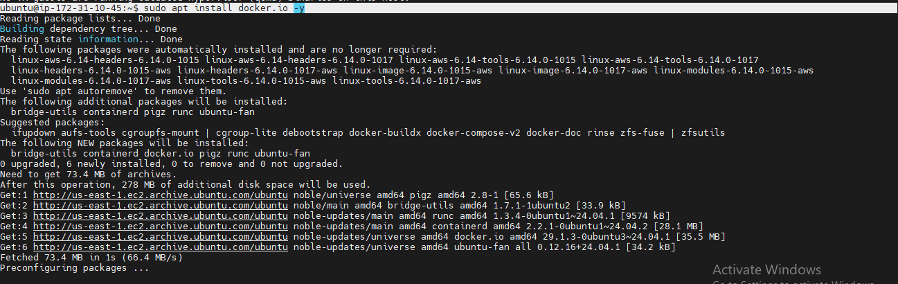
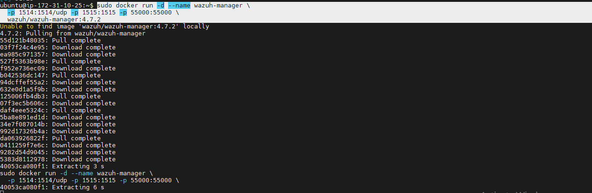
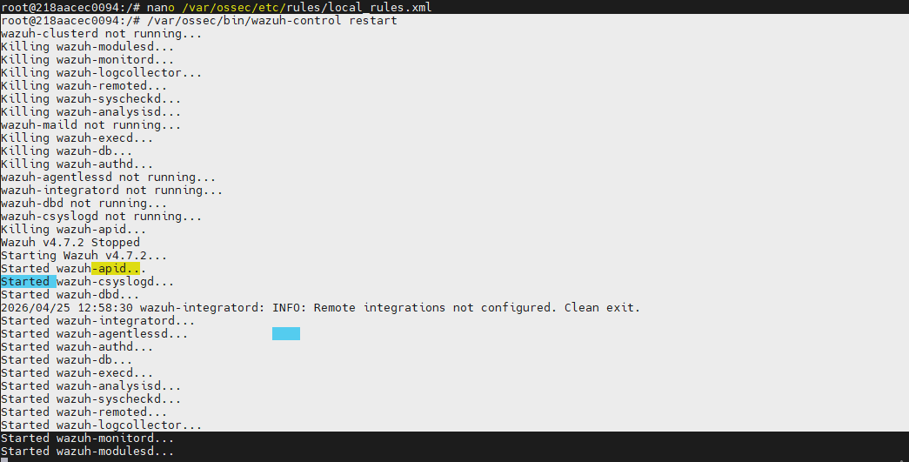

# 🛡️ Lab 01 – Introduction to SIEM using Wazuh

## 🎯 Objective

The purpose of this lab was to deploy and configure a basic SIEM environment using Wazuh for security monitoring and log analysis.

---

# 🛠️ Tools Used

* Wazuh
* Docker
* Ubuntu Linux
* AWS EC2 Instance
* SSH

---

# ⚙️ Step 1 – Install Docker

First, Docker was installed on the Ubuntu server to deploy Wazuh containers.

```bash
sudo apt update && sudo apt upgrade -y
sudo apt install docker.io -y
sudo systemctl start docker
sudo systemctl enable docker
```

## 📸 Screenshot 1 – Docker Installation

*Add Docker installation screenshot here*

```markdown

```

---

# ⚙️ Step 2 – Deploy Wazuh Manager

The Wazuh manager container was deployed using Docker.

```bash
sudo docker run -d --name wazuh-manager \
-p 1514:1514/udp \
-p 1515:1515 \
-p 55000:55000 \
wazuh/wazuh-manager:4.7.2
```
## 📸 Screenshot 2 – Deploying Wazuh Manager
*Deploying Wazuh Manager screenshot here*

```markdown

```

---

Verify running container:

```bash
sudo docker ps
```
# ⚙️ Step 3 – Configure Log Collection

Wazuh was configured to monitor Linux authentication logs.

```bash
nano /var/ossec/etc/ossec.conf
```

Added configuration:

```xml
<localfile>
  <log_format>syslog</log_format>
  <location>/var/log/auth.log</location>
</localfile>
```

---

# ⚙️ Step 4 – Create Custom Detection Rule

A custom rule was created to detect failed login attempts.

```bash
nano /var/ossec/etc/rules/local_rules.xml
```

Rule added:

```xml
<group name="local,syslog,sshd,">
  <rule id="100001" level="10">
    <if_sid>5716</if_sid>
    <description>Multiple Failed Login Attempts Detected</description>
  </rule>
</group>
```
## 📸 Screenshot 3 – Custom Rule Configuration

*Add custom rule screenshot here*

```markdown

```

Restart Wazuh service:

```bash
/var/ossec/bin/wazuh-control restart
```
## 📸 Screenshot 4 – wazuh-control restart

*Add wazuh-control restart screenshot here*

```markdown

```


---

# ✅ Results

* Successfully deployed Wazuh SIEM using Docker
* Configured log monitoring for authentication logs
* Created custom detection rules
* Improved understanding of SIEM deployment and log analysis

---

# 🔐 Skills Gained

* SIEM Deployment
* Docker Management
* Log Monitoring
* Security Rule Configuration
* Linux Administration

